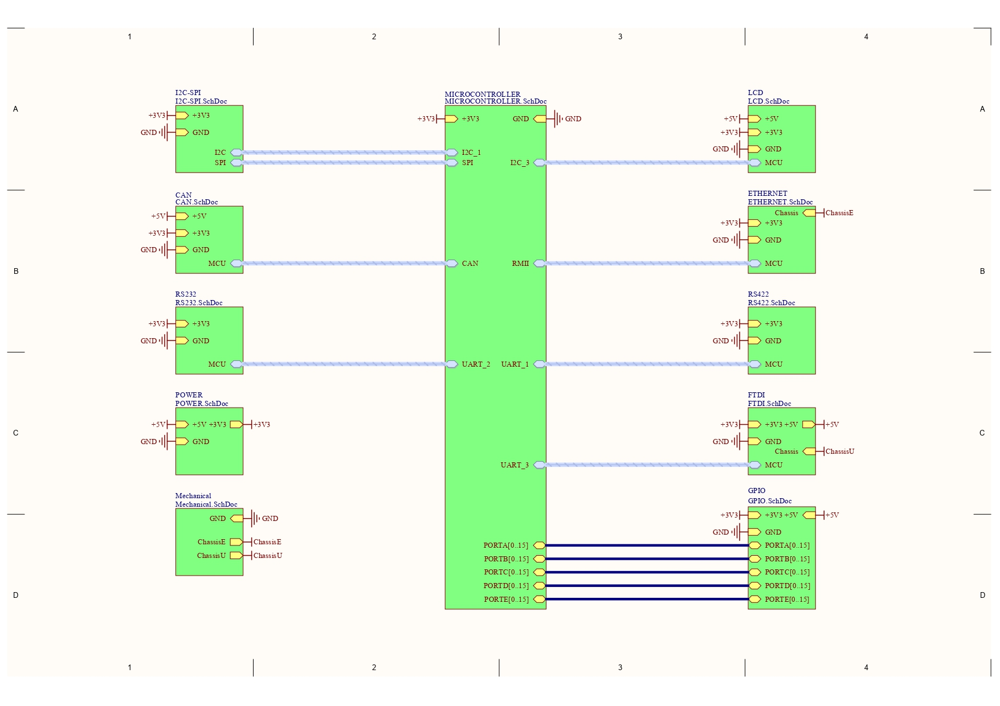
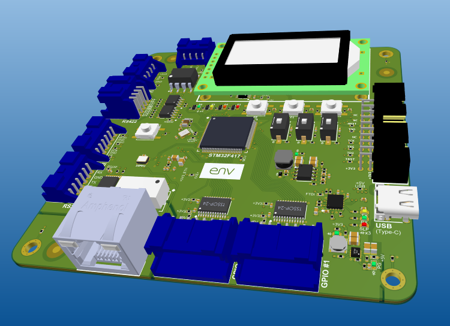

# 🧠 STM32F417 Demo Board




## 📘 Project Overview
This project presents a **multi-purpose demo board** developed for embedded system applications based on the **STM32F417VGT6** microcontroller.  
The design integrates communication, power management, and peripheral systems into a single modular platform suitable for both **educational** and **R&D** purposes.

---

## ⚙️ Technical Specifications

### 🔌 Power Management
- Input Voltage: **+5V / +3.3V regulation**
- Power Regulators: **AP3441SHE-7B, RT2862GSP**
- Power lines are monitorable via **LED indicators**

### 🧩 Microcontroller
- **STM32F417VGT6** (ARM Cortex-M4, 168 MHz, 1 MB Flash, 192 KB RAM)
- All **GPIO ports (A–E)** are accessible through pin headers.
- Includes **25 MHz external crystal oscillator** and **32.768 kHz RTC crystal**

### 🔄 Communication Interfaces
- **RS232** – Full UART conversion with TRS3232IPWR driver  
- **RS422** – Differential communication via SN65HVD30D transceiver  
- **CAN** – Industrial-level communication using ISO1050DUBR isolated driver  
- **USB-UART (FTDI)** – Implemented with FT230XQ-R chip for programming and serial communication  
- **Ethernet** – DP83848IVV/NOPB PHY over RMII protocol with RJ45 connector  

### 🖥️ Display Interface
- **I2C-based 8x2 LCD** (AMC0802BR)
- Level shifter: **NVT2002DP**
- Supports **backlight control** and **contrast adjustment**

### 🔬 Other Components
- **TVS diode protection** for all communication ports  
- **SWD/JTAG** programming interface  
- **Reset and Boot** push buttons  
- **GPIO expansion headers**

---

## 🧱 Hardware Files
The project was designed using **Altium Designer 23+**.  
It includes the following schematic files:

- `POWER.SchDoc` – Power circuit  
- `MICROCONTROLLER.SchDoc` – STM32F417 core  
- `CAN.SchDoc`, `RS232.SchDoc`, `RS422.SchDoc` – Communication modules  
- `FTDI.SchDoc` – USB–UART interface  
- `LCD.SchDoc` – Display module  
- `ETHERNET.SchDoc` – RMII Ethernet subsystem  
- `GPIO.SchDoc` – Pin mapping and expansion  
- `Mechanical.SchDoc` – Mechanical dimensions and references  

---

## 🧰 Development Environment
- **EDA Software:** Altium Designer 23.0  
- **Microcontroller IDE:** STM32CubeIDE  
- **Programming Interface:** ST-Link V2  
- **PCB Layers:** 4-layer  
- **Power Planes:** +3.3V / +5V / GND separated  

---

## 🚀 Use Cases
- Embedded system test platform  
- RS232/RS422/CAN communication experiments  
- Ethernet-based IoT or data transfer projects  
- LCD-based menu interface prototyping  
- Educational and hardware verification environments  

---

## 📁 Project Structure
```
📂 STM32F417_Demo_Board
 ├── Schematic_Files/
 │   ├── POWER.SchDoc
 │   ├── MICROCONTROLLER.SchDoc
 │   ├── RS232.SchDoc
 │   ├── RS422.SchDoc
 │   ├── CAN.SchDoc
 │   ├── LCD.SchDoc
 │   ├── FTDI.SchDoc
 │   ├── ETHERNET.SchDoc
 │   └── GPIO.SchDoc
 ├── PCB/
 │   └── STM32F417_Demo_Board.PcbDoc
 ├── Outputs/
 │   ├── Gerber/
 │   ├── Assembly/
 │   └── PDF/
 └── README.md
```

---

## 👨‍💻 Contact
If you have any questions or want to collaborate, feel free to reach out via GitHub or [LinkedIn](https://www.linkedin.com/in/envergokaycay/).
